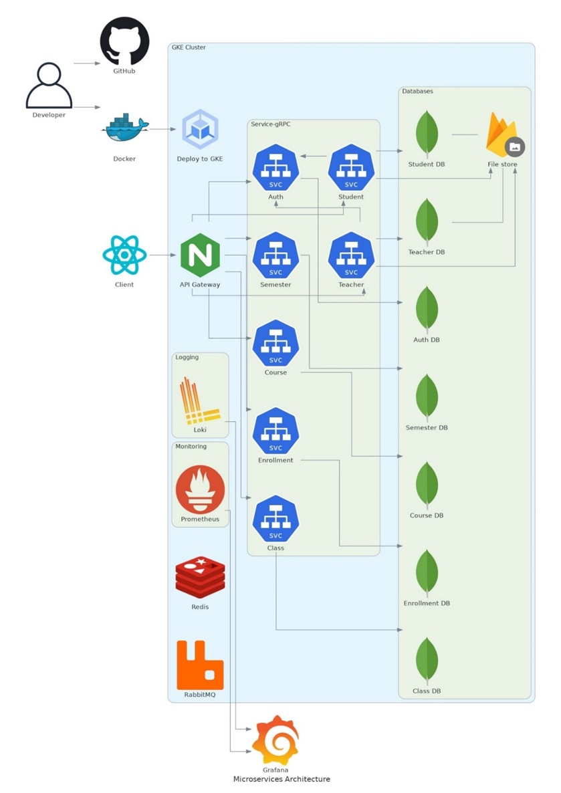
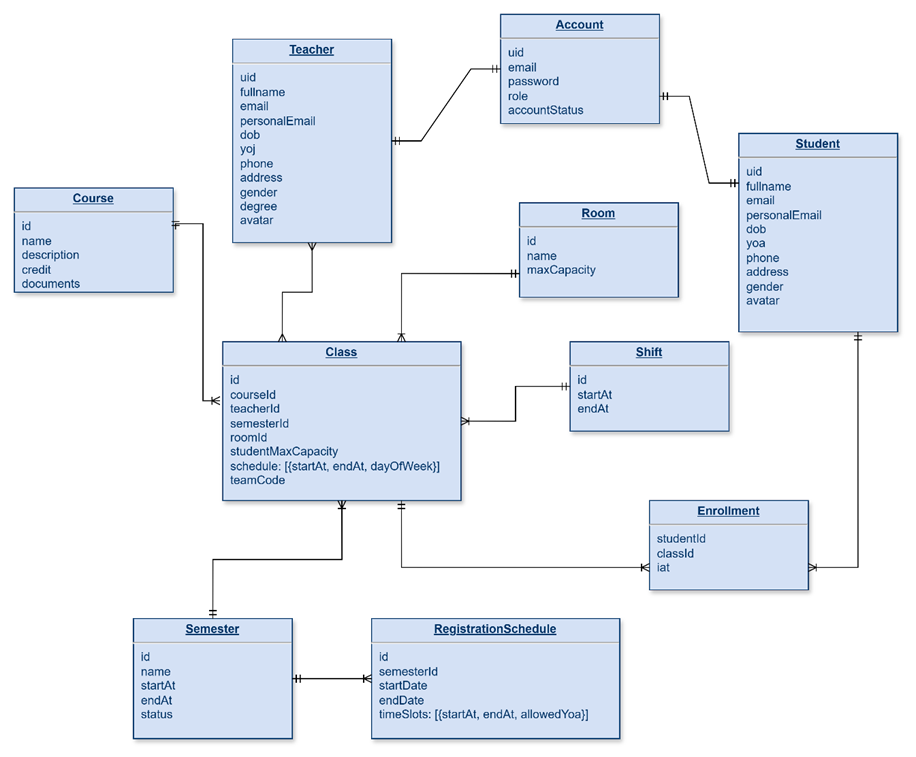
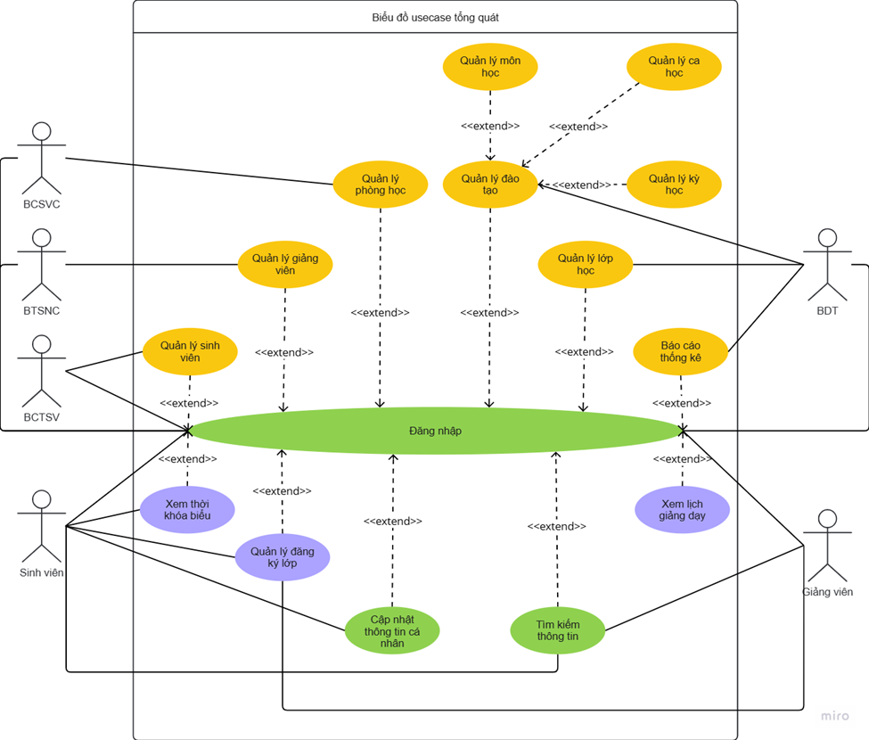
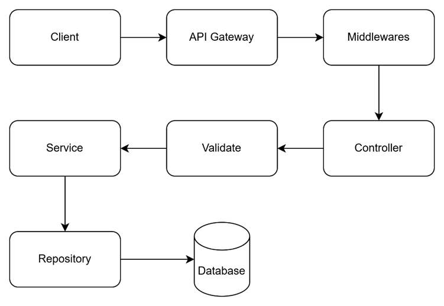

# Infracstructure

# Database

# Usecase diagram

# API flow

# env sample

authPrefix=
coursePrefix=
teacherPrefix=
studentPrefix=

authService=
courseService=
teacherService=
studentService=

authGRPC=
courseGRPC=
teacherGRPC=
studentGRPC=

port=
refreshKey=
accessKey=

authDb=
courseDb=
teacherDb=
studentDb=

reidsUrl=redis://localhost:6379
mqUrl=amqp://localhost

nodeEnv = "dev"
